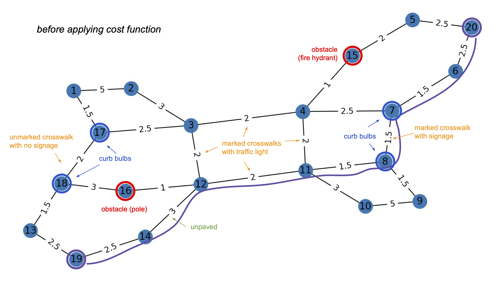
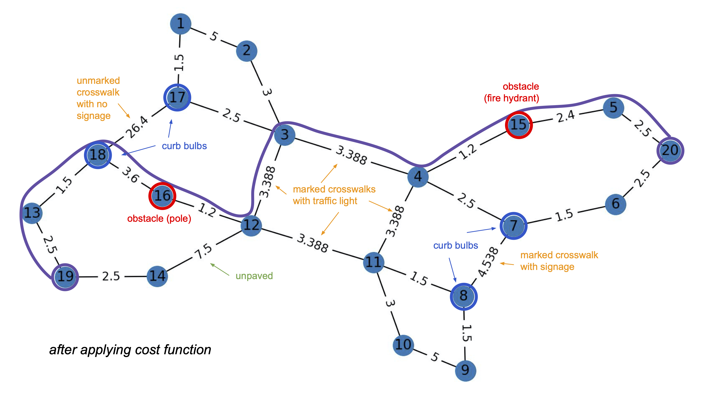

Over the past two weeks, my mentor and I have solidified the attributes we are interested in using for the cost function. The attributes are as follows: (1) the complexity of intersections; (2) the surface material of a pedestrian pathway; (3) the presence of obstacles on a pedestrian way, such as a fire hydrant or streetlight pole; (4) the presence of "curb bulbs"; and (5) the safety of a crossing. If I am able to successfully implement these aspects, I will shift towards thinking about the role of land use adjacent to a pedestrian way in the cost function; however, this will likely involve a more complex pipeline (accessing satellite imagery and subsequently extracting tags).

Once I knew which aspects of the built environment to primarily focus on, I concocted a tiny 20-node network to play around with different potential cost functions. The original network is pictured below:



I picked node 19 as the start node and node 20 as the end node, and ran a simple shortest path algorithm, which resulted in the path traced in the photo. As you can see, this path uses a crossing that is only controlled by signage as opposed to traffic lights and an unpaved stretch of sidewalk.

The cost function prototype I developed loops through all of the existing edges and updates their "distance" by a certain factor. The image below represents the network once the weights have been updated. Once again, node 19 is the start node and node 20 is the end node.



As you can see, the new route is technically longer; however, it avoids the crossing without traffic control through stoplights as well as the unpaved segment. The new route also passes through two "obstacles" - the fire hydrant and the pole. The current cost function does not highly penalize obstacles because most people with visual impairments that feel comfortable navigating by themselves are highly skilled in Orientation & Mobility (O&M) and thus would easily avoid common obstacles such as poles and fire hydrants. While it is less important to avoid these obstacles, it is still important to collect information about their locations. The routing directions could potentially highlight these obstacles if we have enough data (ex: "In 30 meters, there will be a fire hydrant in the middle of the sidewalk").

The prototyped cost function is highly customizable. Currently, it takes in a set of booleans which denote if each feature is important to the user (ex. whether the route should avoid unpaved segments). Eventually, the cost function might take in floats which denote _how_ important each feature is and this float would then influence how the weights are scaled. I implemented an example of this in the code dealing with intersections:

```python
if intersection:
    for (u, v, i) in G.edges.data('inters', default=0):
        if i > 0:
            penalty = 1 + (i / 10)
            G.edges[(u, v)]['d'] *= penalty
```

The amount each crossing is penalized is proportional to how many streets are in the intersection. Note that even the crossings that only intersect 1 street are still slightly penalized; this is because the cost function should never be negative. We are trying to obtain an additive cost function so that we are able to maintain the invariant that the shortest path is the best path.

There are many things I still need to think through:
- In the actual implementation, I would not want to be modifying the distance - for routing purposes, it is important that the original distance is maintained.
- Curb bulbs - at crossings vs in general
- Obstacles in general (avoiding vs being indifferent)
- So many attributes of a "good crossing" - how to distill and get preference? Ex. speed limit, (accessible) pedestrian signal, one way/two way streets, tactile paving, pedestrian visibility, etc.

Next week, I will be meeting with Nick, a graduate student who has created nearly all of the existing codebase. I will work with him to understand the best way to go about developing my cost function within the existing webapp. 

_(Note: a quick logistical update - as you may have noticed, I have shifted to providing updates every other week; this is because I am working part-time on this project for the next few weeks and I want to continue to update after every 40 hours of work for consistency!)_