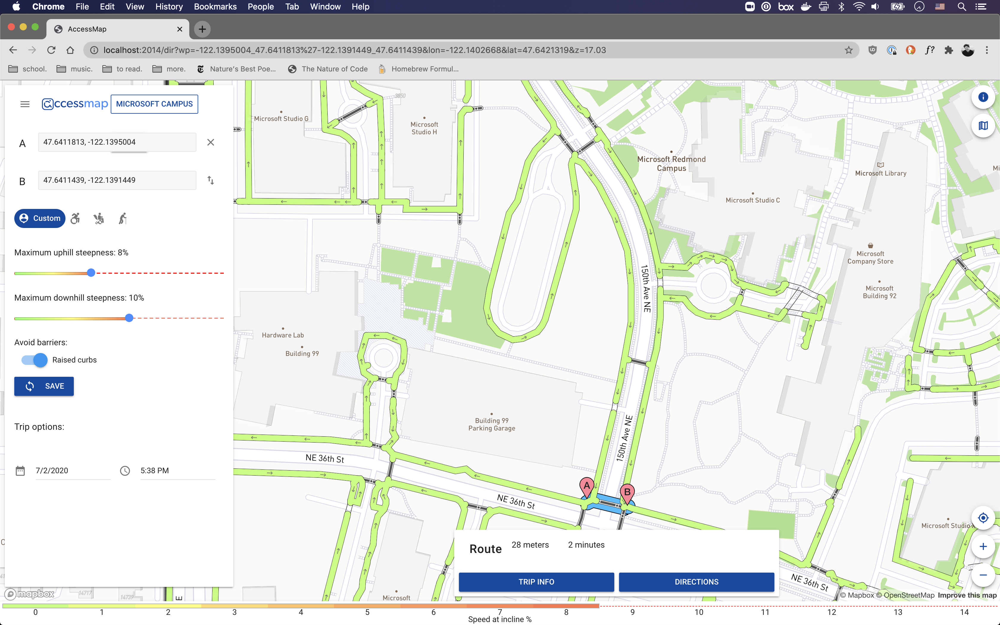
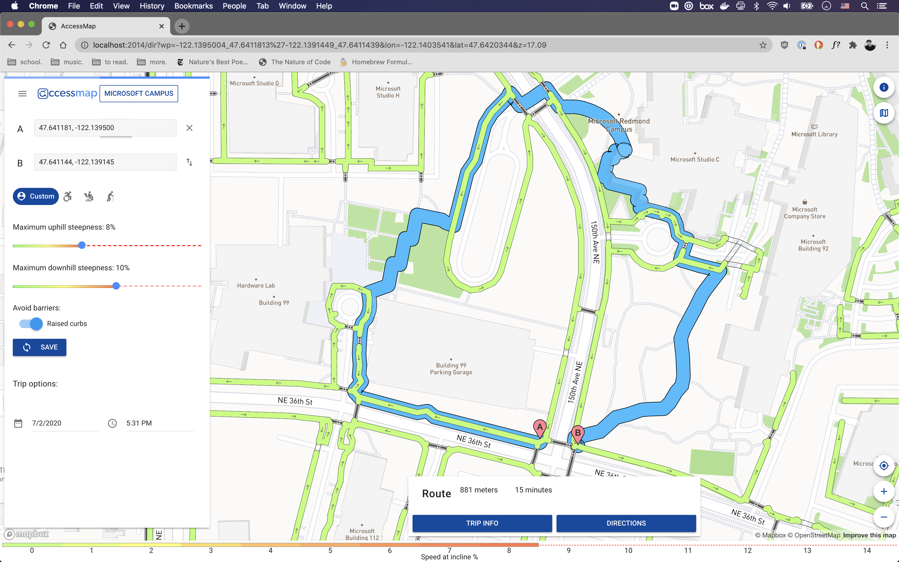

The past two weeks have been much more hands-on, as I have been getting comfortable with the AccessMap application and beginning to modify it to better fit the needs of a user with visual impairments. For the next few weeks, I will be working in a real-life "sandbox": the Microsoft Campus in Redmond, WA. Dr. Caspi has a few contacts there who are able to add the features we are interested in to OSM. At the beginning of week 5, I used the AccessMap data pipeline to extract the pedestrian graph for the Microsoft Campus.

About halfway through week 5, I met with Nick and got an overview of the different frontend and backend components of AccessMap. Afterwards, I set out to get a local copy of AccessMap working on my machine. Despite the detailed documentation, I wasn't able to get it running on the first try. After a few hours of trying to interpret vague error messages and Stack Overflow-aided experimentation, I figured out that there was a problem with the default port the web server was using.

Once I (finally!) got the application up and running, I started to play around with the cost function. Given the unusal tagging schema of the Microsoft Campus, I first modified the cost function to allow routes that use pedestrian streets, pathways, footways and service roads, as opposed to just sidewalks. Because the cost function only modifies the value of edges, all point-like attributes, such as curbramps, tactile paving, and fire hydrants must be added as metadata to certain edges. I modified the data pipeline for the microsoft campus in order to associate tactile paving points with the nearest crossing. Below are two images that illustrate the difference in routing if tactile paving at crossings is required vs. not required. 

As these images demonstrate, the cost function has a very big impact on the perceieved "best" route. In the above example, I had set tactile paving to be a boolean input to the cost function; thus, regardless of how much longer a route with tactile paving at crosswalks would be, it would always be returned as opposed to a much shorter route without tactile paving. I was following the AccessMap example of curbramps: a person using a wheeled device needs curbramp access for crossings to be traversed. With visually impaired people and tactile paving, though, there is not necessarily the same "intraversability" associated with a lack of tactile paving. Therefore, I want to rethink the boolean structure and potentially have a slider for the importance of tactile paving at crossings for a user.

Over the past week, I have started to modify the frontend so I will have a better idea of how the cost function will change the values of different edges. I was able to modify the map rendering function to ensure that all relevant pedestrian edges are colored. Currently, the coloring of the pedestrian graph reflects the speed based on the incline of an edge. I hope to change the coloring scheme to reflect some of the attributes that we are incorporating into the cost function, such as surface material and number of landmarks. My other frontend breakthrough was implementing a working tactile paving preference toggle switch!

Looking forward, I am planning on expanding the scope of "clickable" objects and the information that is displayed on a click in order to help with debugging. I will also spend some more time working with the geodata processing code in order to extract landmarks and add the number of landmarks to each edge as an attribute. I have modified the map tiles to include a layer of points, and I would like to be able to display these points on the frontend, as well (this is not as urgent, though). Finally, I need to examine why the webapp is having trouble communicating with the routing engine. It is able to access the map tiles, but whenever a route is requested, it breaks. 