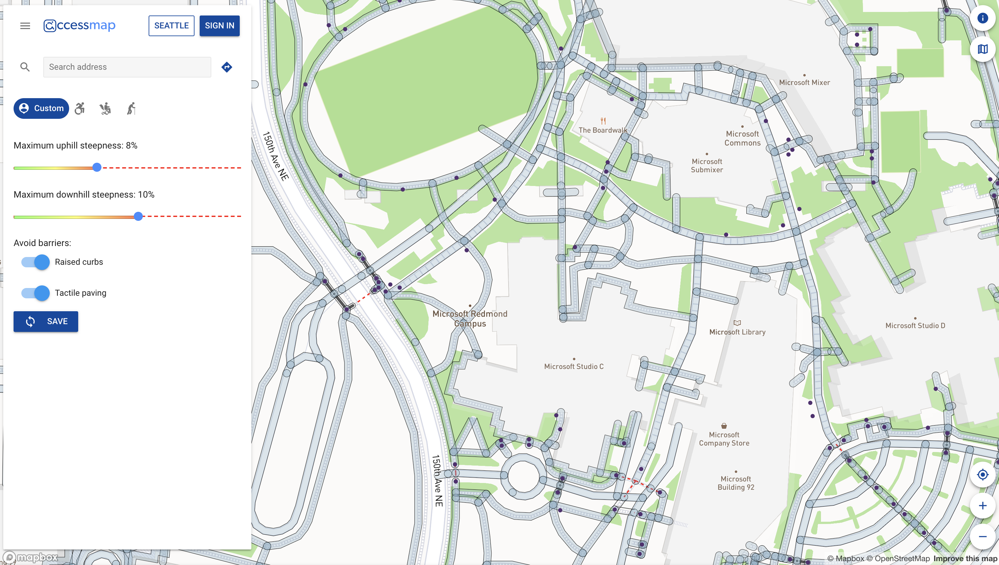
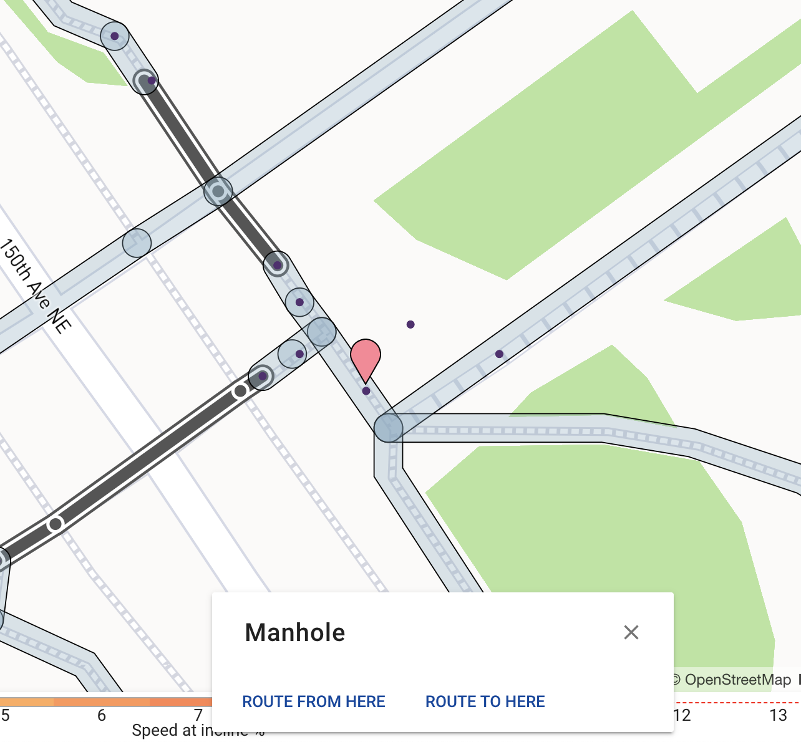

Over the past two weeks, I have completed an exciting mixture of front-end and back-end tasks. I feel like I really know my way around all three repositories (```accessmap```, ```accessmap-data```, and ```accessmap-webapp```)! 

My big accomplishment for these two weeks was extracting and displaying point data on AccessMap. Currently, the tool is only concerned with edge data; however, creating custom routing for people with visual impairments requires point data. I examined some of the recent changelogs on OSM for the Microsoft Campus and used this information to figure out which point data I should extract. Once I had the raw point data, I filtered it and standardized it in order to create a GeoJSON file, which is then passed into another tool to create custom map tiles that the frontend can access and subsequently render. In order for the frontend to render the points, I created a new MapBox layer. The screenshot below is what the application looks like now: both pedestrian path data and point data are visible!



I also changed the frontend to ensure that clicking on a point or any pedestrian pathway would give the user information about the clicked feature. In the screenshot below, the user can see that the point they have clicked on is a manhole, which can be used as a tactile landmark for a person who uses a cane as a navigational aid.



Unfortunately, the frontend is still having trouble connecting with the routing server, so no routes can be requested. Despite troubleshooting with Nick for about an hour last week, this remains an annoying roadblock. It is an unusual problem because the frontend is able to communicate with the tile server and the API, but not the routing server. In order to work around this problem, I am hoping to spend the next few days implementing a more robust color/costing scheme tied to the number of landmarks along a given edge. In order to do this, I must first modify the geodata processing code to associate landmarks with different edges. 

At our most recent meeting, we spent a lot of time thinking about the best way to conceptualize the role of landmarks in navigation for people with visual impairments and how this should be translated into a cost function and graph representation. One idea that Nick mentioned that I am hoping to explore more is the association between landmarks and certainty on a route: the longer someone goes without perceiving a landmark, the less certain they are that they are on the correct route. Therefore, the ideal route would be one with evenly spaced landmarks; the user could specify how far apart the landmarks should be. This idea reminded me of a problem I had for one of my Algorithms problem sets - essentially, a shortest paths problem with fuel constraints. I am still contemplating just how analagous these two representations are, but I think it will be a worthy comparison to make in the coming week.