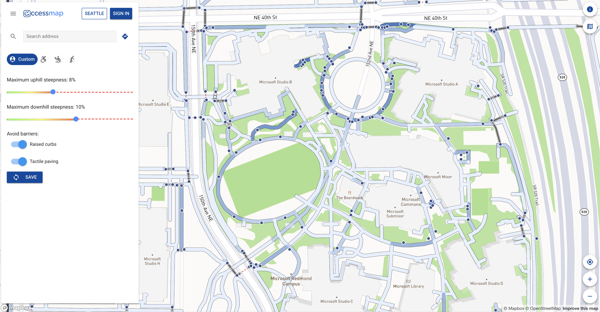
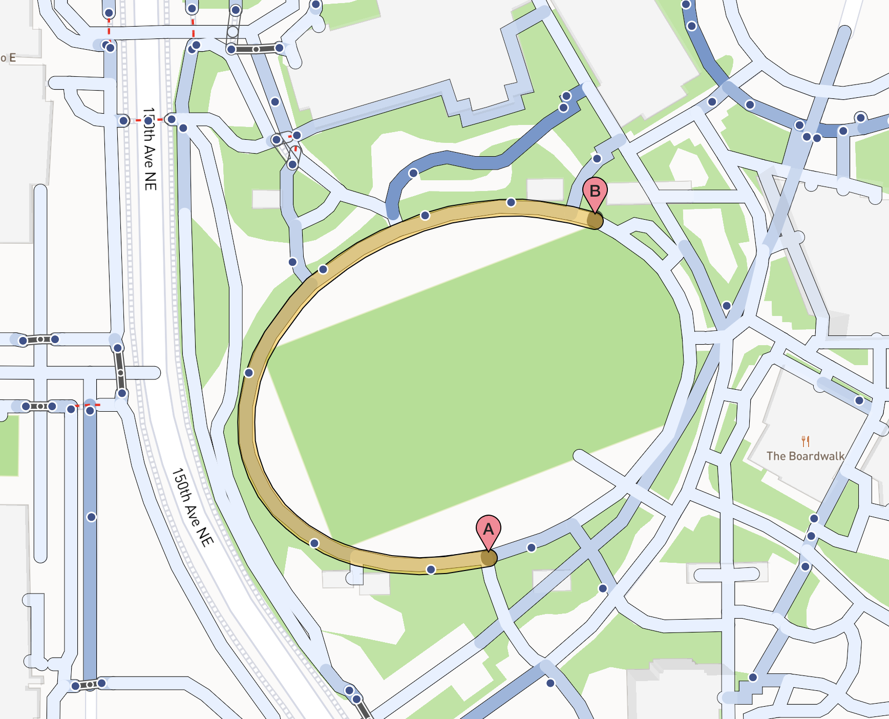
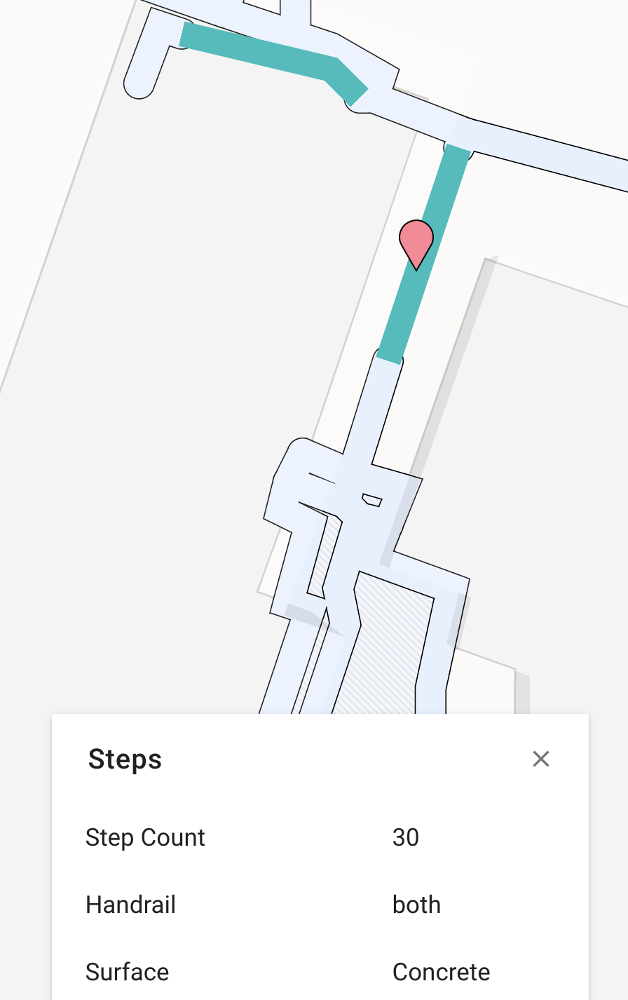

I had a few breakthroughs over the past two weeks! The most exciting one was getting the routing functionality working with the modified frontend. Nick and I spent an hour trying to debug this issue a few weeks ago, but it turned out that the ordering of some of the proxy commands in a configuration file was creating the wrong proxy for certain requests. The frontend and backend are now communicating seamlessly! 

I was also able to add a "landmark_count" attribute to all of the edges in the pedestrian graph. At first, I was attempting to do this all in Python, but ran into a few issues and switched over to working with QGIS. I had worked fairly extensively with GIS software last summer, so I was able to easily calculate how many landmarks were within a certain radius of each edge. (Note: because these steps will need to be repeated if I want to change which data I am extracting from OSM, I made sure to write down the workflow so that it can be easily reproduced; it might be worth it to create an automated QGIS workflow.) Then, I modified the frontend so that the coloring of each edge reflects the number of landmarks nearby. In the below image, a darker blue edge means that there are more landmarks nearby.

Perhaps most excitingly (is that an acceptable adverb?), I modified the cost function to prioritize edges with higher landmark counts. In the below image, the shorter route, distance-wise from A to B is counterclockwise around the oval, but the cost function returns the slightly longer, but more landmarked route. I am currently still experimenting with different penalty schemes; the one that gave the pictured route was a simple multiplication-based penalty but I will be exploring some exponential ones as well. 

I also spent some time modifying OpenStreetMap (OSM) data— specifically, the crossings on the Microsoft Campus. I am interested in incorporating the kind of traffic control at an intersection (ex. traffic lights, stop sign, yield for pedestrian sign) into the cost function, as a well-controlled intersection is much safer to cross. Using some street view data, I was able to update the tags for around 100 crossings and subsequently download the new data from OSM.

I am in the process of modifying the frontend to reflect this data; below is a screenshot of the information displayed when a crossing is clicked on. Eventually, I hope to update the coloring of the crossing depending on how safe it is.

Finally, I also added a simple layer that displays stairs. When stairs are clicked on, the step count and handrail status are also displayed if known.

I am still thinking about the potential of sidewalk intersections as landmarks, and how to incorporate that into a cost function. I am also working on how to get user preferences for certain features that might not be a binary yes/no, such as tactile paving, stairs, or crossings. Lastly, I am considering different methods for testing different cost functions; perhaps by building fake transportation graphs and seeing how the routing behaves. Overall, I am excited about where I am at with this project and looking forward to the work I have ahead of me!