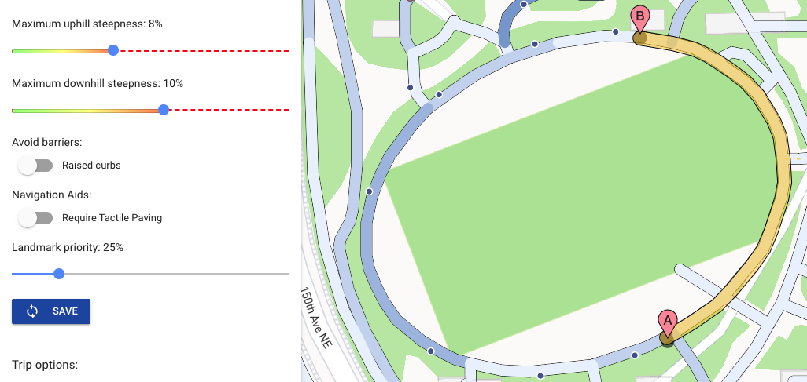
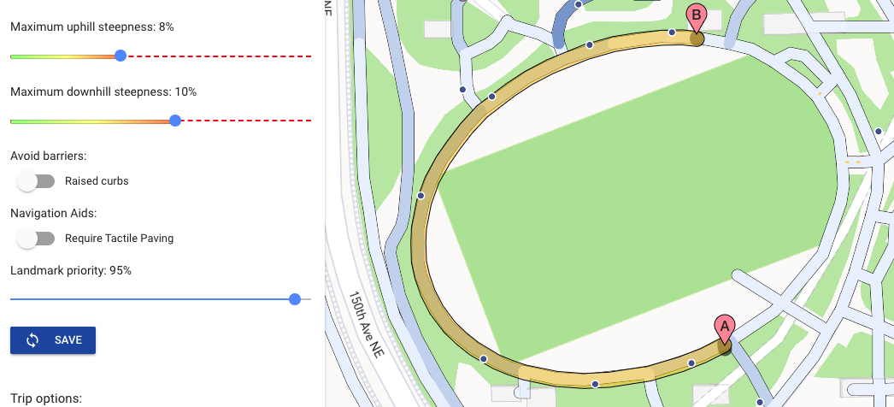
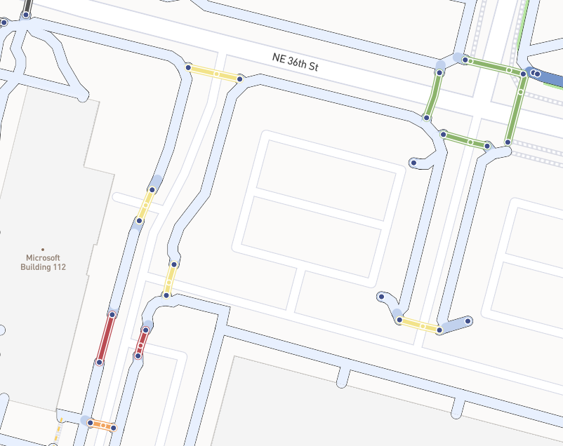
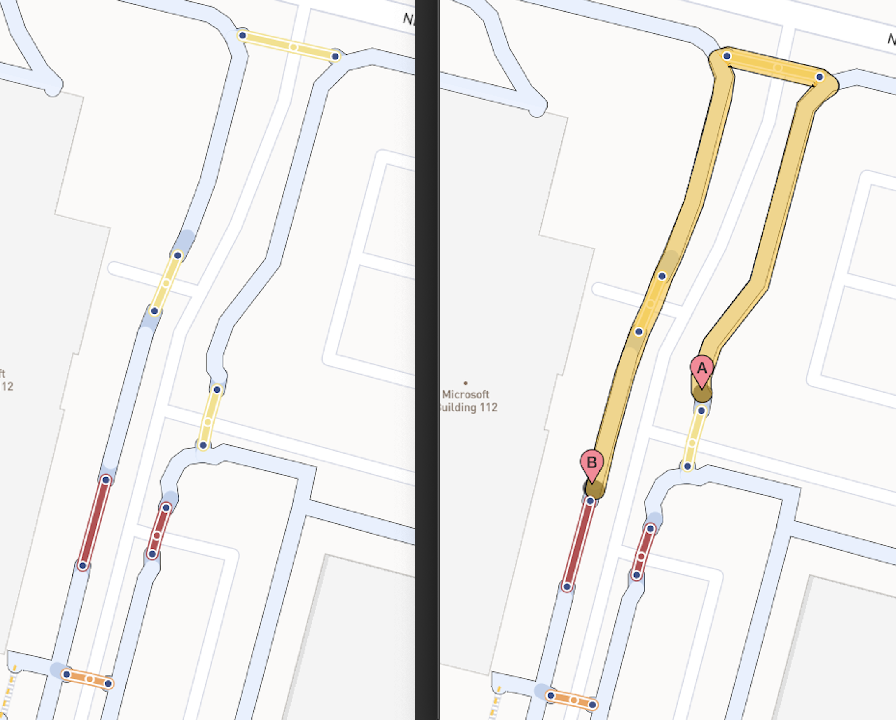

As the program comes to an end, I've been polishing the features I've added and thinking more about how to get feedback on the application as it stands now. The three main things I worked on over the past two weeks were (1) a customizable landmark priority slider (2) more informative user interfaces for crossings, and (3) routing that takes into account the traffic control at a crossing and the presence of stairs. 

The landmark priority slider allows the user to dictate how important a route with a lot of landmarks is to them. In the images below, you can see how the route around the circle changes depending on the landmark priority value: in the first image, it is at 25% and in the second image it is at 95%. 

This is an exciting feature because it not only allows for more customizable routes, but also allows me to test the sensitivity of my cost function infrastructure. Hopefully I will be able to implement similar sliders for all of the other attributes we consider for the final cost function.

The second area I focused on was improving the user interface for crossings and stairs. In the image below, you can see different colored crossings; they are colored according to what kind of traffic control is present at each. Green crossings are controlled by traffic lights, yellow crossings by stop signs, orange crossings by a pedestrian/yield sign, and red with no formal traffic control method. 

Finally, I modified the cost function to take into account the different forms of traffic control at crossings, prioritizing the safer crossings. An example of this type of routing can be seen in the image below; on the left is a sidewalk network with six different crossings and on the right is the route calculated using the modified cost function to get from one side of the street to the other. As you can see, the calculated route chooses the crossings with stop signs as opposed to the routes with yield signs or no traffic control. I also changed the cost function to avoid routes with stairs, but I'm hoping to take a more nuanced approach soon.

I am currently working on reconfiguring the data in order to associate landmarks with edges and convey this information in the directions for the route. I was able to successfully work with geopandas and shapely to transfer my previously established QGIS work that counted the number of landmarks near an edge to pure python. This means that my modified data pipeline can be run with one command! (No more mucking around with GIS applications midway through.) This new data pipeline not only counts the number of point features near a line, but stores the type of point and its distance alond the line on the line. This means that all of the landmark information is associated with the edges, and therefore when the route is returned by the routing engine (unweaver), the landmark information can be used to give directions. Because I am adding a new feature to edges, I'll need to modify a few packages that Nick developed (entwiner and unweaver) in order to ensure that the graph is constructed correctly with the new edge attribute. By the end of next week, I hope to successfully modify unweaver and entwiner in order to have a prototype of the directions cards with landmark information.

My other research project just finished up this week, so I'll have more time to dedicate to AccessMap! I'm excited to get some feedback on the interface and the routing from some Orientation & Mobility specialists in the coming week; hopefully, I will be able to think more critically about how to make the interface and routes accessible to people with visual impairments. 