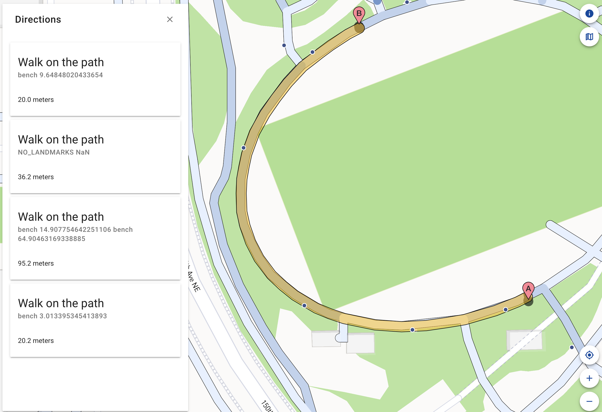

This week was exciting because I was finally able to meet with an Orientation & Mobility (O&M) specialist and receive feedback on the changes I have made to AccessMap. Dr. Caspi and I met with Amy Parker, a professor at Portland State University and expert in all things orientation-mobility related. 

Amy thought that the work we had done so far had great potential for an exploratory tool as well as a routing tool. She pointed us towards [UniDescription](https://unidescription.org/), a project that two of her colleagues are working on which focuses on translating visual media to audible media. The UniD team has worked with the National Park Service to create audio descriptions of maps, so we might be able to collaborate and ideate with them in order to create a fully accessible AccessMap instance for people with visual impairments! The ultimate goal might be a sort of "narrative map" with a flow from broad information about the space to specific descriptions of a few different routing options.

During our meeting, we talked about some other details such as options for people with both visual and hearing impairments, how the "shorelining" technique works, special routing considerations for people with guide dogs, especially dangerous situations such as roundabouts, and the importance of having customizable options for any audio-based application. 

I also got the directions cards more or less working! This required some modifications to both entwiner and unweaver, and because I have not developed python packages before, I had to learn a little more about that before I was able to successfuly create a graph with multidirectional edges that reflected the correct ordering of landmarks regardless of the direction of the edge. There is still a lot more to think about with the directions cards, such as the level of detail to provide about the pathway (surface material, perhaps?) and how to infer cardinal or clock face information from the graph. In the image below, you can see a basic prototype of the "landmarked" directions; the locations of all the landmarks along a segment are below the "Walk on the path" instruction.

Next week, I hope to polish up the directions cards and get started on my final report! Dr. Caspi and I might also meet with another O&M specialist, David Miller. Though I've been working on this project for nearly the whole summer, I still feel like there is so much to do! Dr. Caspi and I have discussed possibilities for continuing the work, and I am excited to keep doing research with the Taskar Center for the upcoming semester.